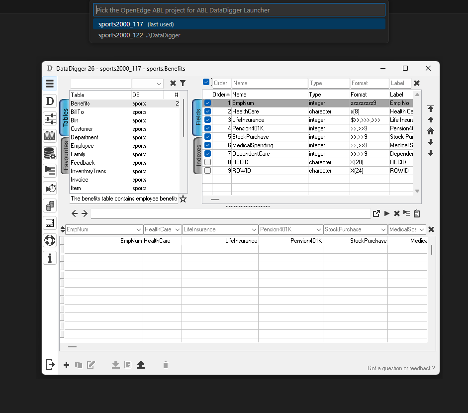

# ABL DataDigger Launcher for VS Code

A simple VS Code extension to launch DataDigger for OpenEdge ABL projects.

## Related Software
- [DataDigger](https://datadigger.wordpress.com/) is an OpenEdge ABL application for querying Progress databases, written by [Patrick Tingen](https://github.com/patrickTingen). A DataDigger instance is bundled with this extension, but it can also be installed [manually](https://github.com/patrickTingen/DataDigger).
- This extension depends on the [OpenEdge ABL](https://marketplace.visualstudio.com/items?itemName=RiversideSoftware.openedge-abl-lsp) extension by [Riverside Software](https://marketplace.visualstudio.com/publishers/RiversideSoftware).

## Description
For every OpenEdge project with a configured database connection, DataDigger can be launched directly from the VS Code Command Palette.

You can either use a custom-installed and configured DataDigger instance, or use the bundled DataDigger out of the box.

## Usage
At startup, the extension detects the available OpenEdge projects.
Via the Command Palette (`Ctrl+Shift+P`), DataDigger can be launched using the command:

`ABL DataDigger: Launch`

If multiple OpenEdge projects are detected, you will be prompted to select the project to use.

## Settings

### User / Workspace / Folder
- **DataDigger path**  
  Path to a custom DataDigger installation. When empty, the bundled DataDigger will be used.
- **Add project client parameters**  
  When enabled, the OpenEdge project client parameters are added when starting DataDigger.
  **Note:** Changing this setting and/or modifying the OpenEdge client parameters in `openedge-project.json` requires a restart of VS Code before the changes take effect.
  Defaults to `false`.
- **Extra parameters**  
  Additional command-line parameters passed to DataDigger on startup.
  Defaults to `-nosplash`.

### User only
- **Enable debug logging**
  Enables debug-level logging for this extension.
  Defaults to `false`.

## Related Extensions
You may also be interested in the database query extension by [Baltic Amadeus](https://marketplace.visualstudio.com/publishers/BalticAmadeus), named [ProBro](https://marketplace.visualstudio.com/items?itemName=BalticAmadeus.pro-bro).

## Support
Please report issues and feature requests via the GitHub repository.

## Licensing and Legal Notices
- This extension is licensed under the [MIT License](LICENSE).
- This extension bundles source code from **DataDigger** (© 2021 Patrick Tingen), licensed under the MIT License.
  See [THIRD-PARTY-NOTICES](THIRD-PARTY-NOTICES.md) for details.
- OpenEdge and ABL are registered trademarks of Progress Software Corporation.
